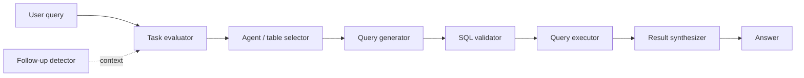

# Sequel

> **Ask your database in plain English.** Sequel is an agentic natural-language-to-SQL assistant:
> ask a business question and get a validated SQL query, its results, and a synthesized answer —
> driven by a multi-step agent pipeline.


## Why this exists

Business users shouldn't need SQL to answer data questions. This service turns a natural-language
query into a safe, validated SQL statement against a known schema, runs it, and explains the result —
with follow-up awareness so a conversation ("...and just for last month?") keeps context.

## How it works

The agent runs as a staged pipeline (in `core/actions/`):



- **`main.py`** — FastAPI server. Main endpoint: `POST /business-solutions/sql-agent/run`
  (`{session_id, user_query, chat_id}`); health at `/health_check`.
- **`app.py`** — `process_data_insight(...)`, the core orchestration called by the API.
- **`core/actions/`** — the pipeline steps: task evaluator, table selector, query generator, SQL
  validator, query executor, result synthesizer, chat history, follow-up handling.
- **`core/connectors/LLMClient.py`** — LLM access. **`core/utils/`** — DB access, data processing,
  filtering, follow-up detection, pandas helpers.
- **`prompts/`** — prompt templates for each agent step.
- **`streamlit_app.py`** — a simple chat UI that calls the backend.

## Quickstart

**Prerequisites:** Python 3.11, a reachable SQL database, and LLM credentials (see Configuration).

```bash
# create & activate a virtualenv
python -m venv venv
venv\Scripts\activate            # Windows
# source venv/bin/activate       # macOS/Linux

pip install -r requirements.txt

# configure (see below), then run the API
uvicorn main:app --reload --port 8086

# in another terminal, run the UI
streamlit run streamlit_app.py
```

## Configuration

Configuration lives in `core/config.py` (`ALLOWED_ORIGINS`, `DATA_INSIGHT_ABOUT_CONFIGURATION`, DB
and LLM settings). **Do not hardcode secrets** — move DB credentials and LLM keys to a `.env`
(git-ignored) and read them via `python-dotenv`. Add a `.env.example` documenting the variables.

## Project structure

```
Project_NL2SQL5/
├── main.py                  # FastAPI entrypoint
├── app.py                   # core orchestration (process_data_insight)
├── streamlit_app.py         # chat UI
├── core/
│   ├── actions/             # agent pipeline steps
│   ├── connectors/          # LLM client
│   ├── utils/               # DB, data processing, follow-up, pandas helpers
│   ├── config.py
│   └── logger.py
├── prompts/                 # prompt templates
├── data_dictionary/         # schema descriptions
├── requirements.txt
├── table_descriptions.csv
└── *test*.py / debug_*.py   # dev/test scripts
```

## Roadmap

- [ ] Move DB creds + LLM keys to `.env` (+ `.env.example`); remove any hardcoded config.
- [ ] Reconcile the UI backend URL with the API route (UI points at `/data-insight`; API serves `/business-solutions/sql-agent/run`).
- [ ] Consolidate root-level `debug_*` / `test_*` scripts into `tests/` and `scripts/`.
- [ ] Add a linter (ruff) + CI.

## Status

Working prototype (★★). Runs the full NL→SQL pipeline; needs config/secrets hardening and repo
polish before any public release. Tracked in `../Mission_Control/portfolio.md`.
